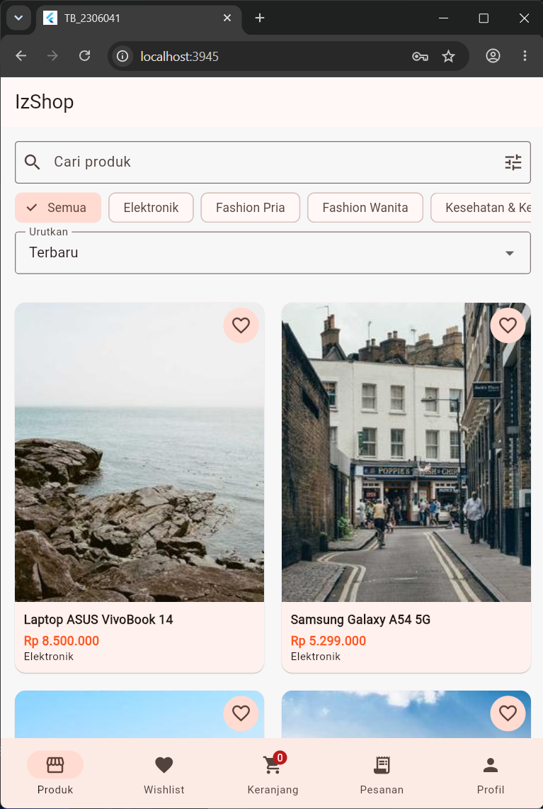
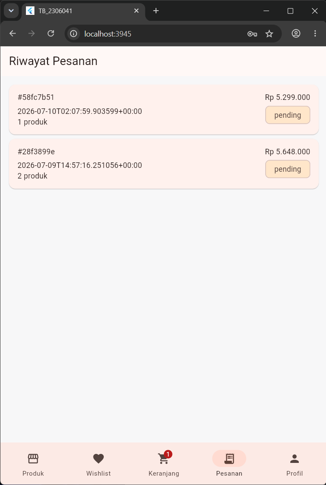
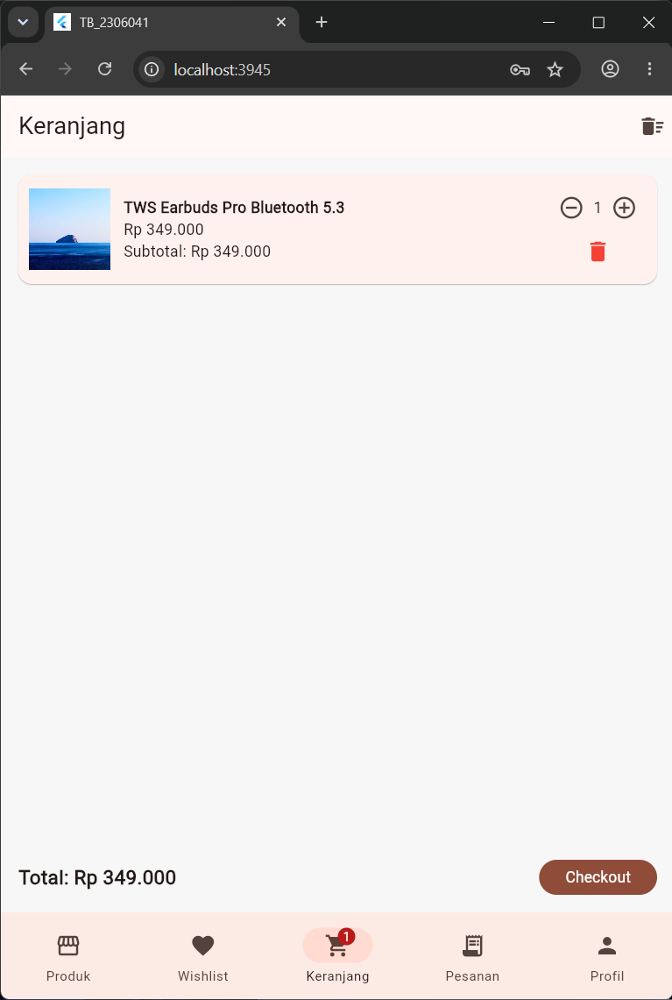
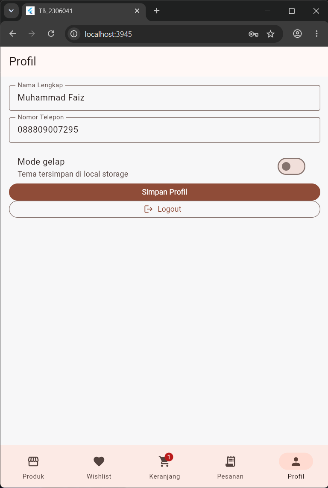

# UAS Commerce Flutter

Aplikasi e-commerce Flutter untuk UAS Praktikum Pemrograman Mobile.


---
## Identitas Mahasiswa
- **Nama**: Muhammad Faiz Alfarizi
- **NIM**: 2306041
- **Kelas**: Informatika B

## Fitur utama

- Register dan login JWT.
- Auto login dengan SharedPreferences.
- Profil user dan update profil.
- Katalog produk dengan search, filter kategori, sorting, dan pagination.
- Detail produk, ulasan, dan tambah ke keranjang.
- Keranjang belanja dengan update quantity, hapus item, kosongkan keranjang, dan badge counter.
- Checkout dan riwayat pesanan.
- Opsi B: wishlist lokal, dark mode, dan notifikasi lokal saat pesanan berhasil.

## Endpoint API

Aplikasi memakai base URL berikut:

- Android emulator: `http://10.0.2.2:3000/api`
- Web, desktop, dan device lain: `http://localhost:3000/api`

Swagger: `http://localhost:3000/api-docs`

## Struktur folder

```text
lib/
├── core/
│   ├── constants/
│   ├── helpers/
│   └── services/
├── data/
│   ├── local/
│   └── network/
└── presentation/
    ├── app/
    ├── pages/
    │   ├── auth/
    │   ├── cart/
    │   ├── checkout/
    │   ├── orders/
    │   ├── product/
    │   ├── profile/
    │   └── wishlist/
    └── widgets/
```

## Cara menjalankan

```bash
flutter pub get
flutter run
```

Pastikan backend lokal sudah berjalan di port `3000`.

## Screenshot ##
Berikut adalah tampilan antarmuka dari aplikasi IzShop:

| Halaman Beranda (Home) | Halaman Pesanan |
| :---: | :---: | :---: |
|  |  | 

| Halaman Keranjang Belanja | Halaman Wishlist | Halaman Profil |
| :---: | :---: | :---: |
|  |  |  |